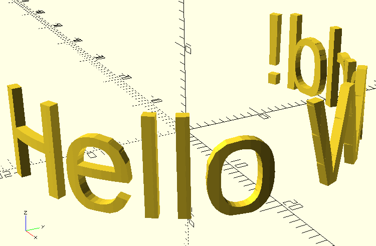

# Map To Cylinder Library

This library provides a function to map a flat-ish geometry to a cylinder. This is most useful for wrapping text around a cylinder, but arbitrary shapes can also be done.

## Usage

Include this library in your OpenSCAD project. Since this library can be opened as a standalone project, use *use* instead of *include* to avoid exectuting example code in your own project.

	use <map_to_cylinder.scad>
	
The geometry of the object to be wrapped should lie along the X-Y plane, and the top surface should be flush with Z=0 with the geometry below. For example, if you have a block of text 1mm thick, translate the text 1mm downward along the Z axis.

	map_to_cylinder(20, 20, fn=128)
    translate([0, 0, -1])
    linear_extrude(1)
        text("Hello World!");

## Caveats

The geometry of the object to be wrapped should be X>=0, Y>=0, and Z<=0. The height (along Y axis) should be up to *h*, and the width should be up to 2 * PI * *r*.

The geometry to be wrapped may not be included when *intersecton()* is executed. Make sure all geometry is inside the bounds. Anything outside the bounds will be excluded.

The final object may result in slightly jagged edges, not a smooth geometry. This is expected. The final object is constructed of thin slices. For smoother results, increase the value of *fn*.

## Functions

### map_to_cylinder(r, h, fn)

This function maps a flat object to a cylinder.

**Parameters**

* r - radius of cylinder
* h - h = height of Cylinder
* fn - controls how many slices make up the cylinder
